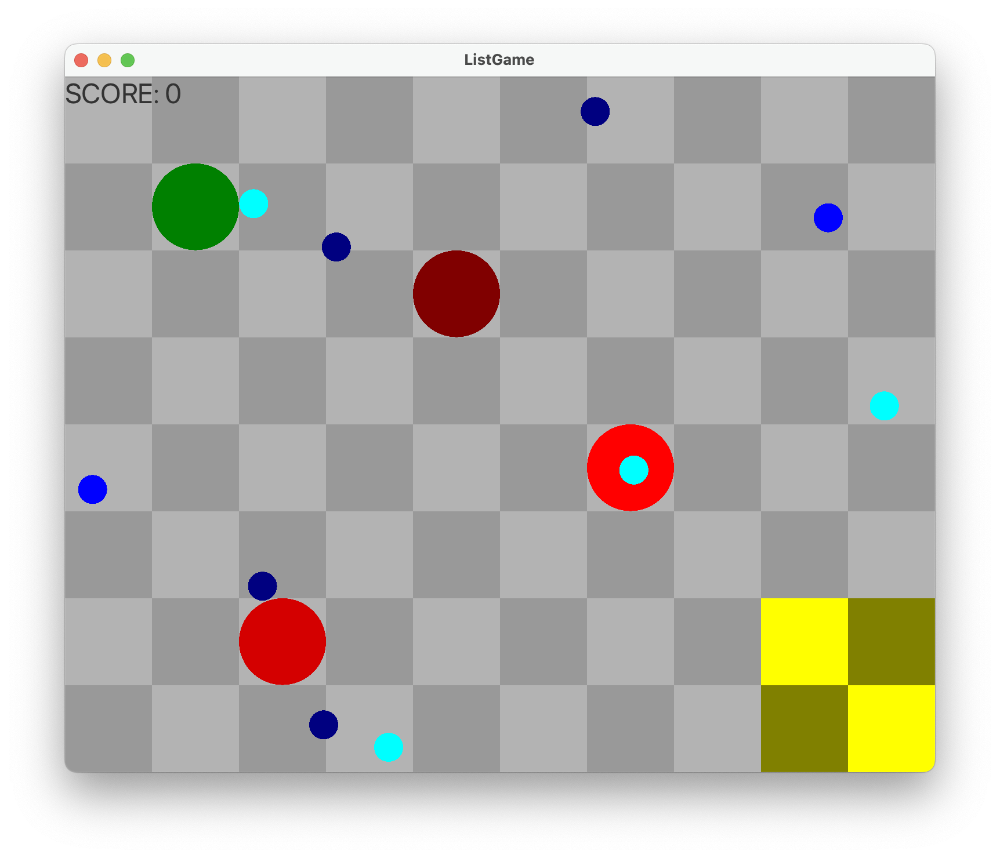
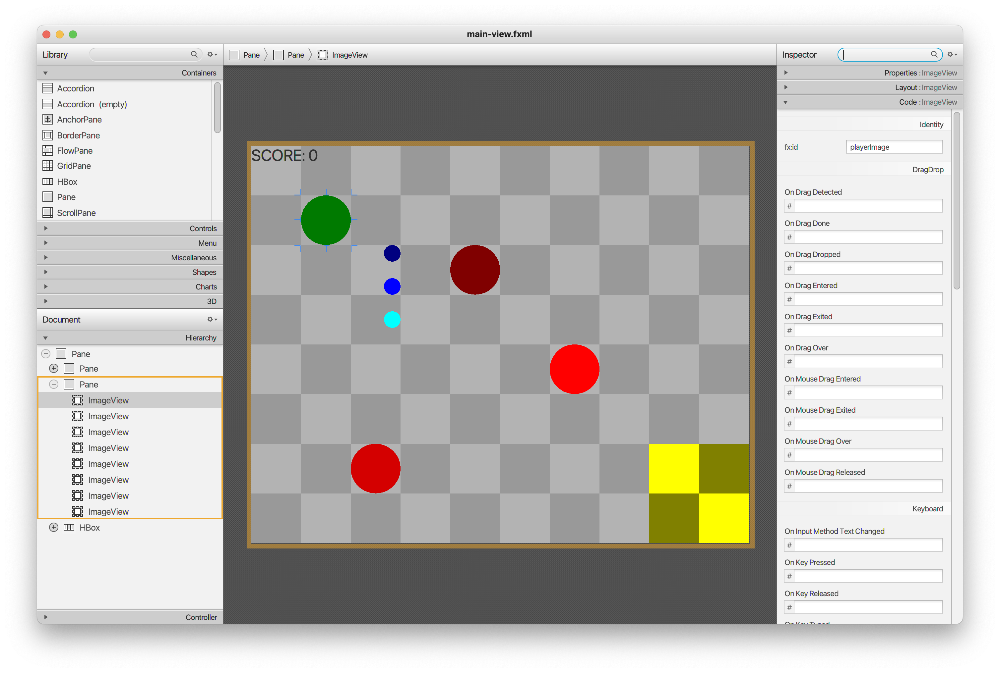

Welcome to the ListGame!

At the end of this lab, you should be able to:
- Implement simple AI behavior switching using an ArrayList, LinkedList, DequeArray
- Describe how the approaches differ in implementation and strengths
- Implement simple visual inventory via ArrayList, LinkedList

When you run **>** you see the game playfield.

You should be able to navigate the green circle (player) around the map using the arrow keys.

This is generated from data that is loaded from the [main-view.fxml](src/main/resources/cs113/listGame/main-view.fxml).

In the layout view we have an outline of the scene:
- Pane (background, holds ImageViews for the tiles)
- Pane (foreground, holds ImageViews for player:green, resources:blue, and enemies:red, goal:yellow)
- HBox (UI, holds score labels)

On the code side, the project is organized into packages based on function:
- behaviors (these are specific AI behaviors)
- enemies (enemies, ours to complete!)
- gamecore (object management, collisions, and input)
- helpers (for cloning JavaFX imageViews)
- resources (lists, ours to complete!)
- Main (launches the program)

To see how objects are integrated from SceneBuilder data, see gamecore->GameController

If you're ready to start on the lab, here are the steps we need to follow to make this into a fully functional game:

0) OPTIONAL replace game images with your own theming
- enemyArray.png // an enemy that randomly selects behaviors
- enemyArrayList.png // an enemy that randomly selects behaviors
- enemyList.png // an enemy that follows behaviors in a chain
- enemyStack.png // an enemy that pushes/pops behaviors
- goal.png // the place to turn in resources
- tile.png // an image that is tiled for the background
- resourceA.png, resourceB.png, resourceC.png // resources to gather
- playerCharacter.png // the image for the player to move around

1) IMPLEMENT resources->ResourceArrayList

We currently have a simple array [ ] solution to gathering resources in resources->ResourceArray.

While it works, it lacks dynamic resizing, and has a lot of specialized code that could be removed by using an ArrayList instead.

For this step, create a new ResourceArrayList class, using ResourceArray for inspiration on how to implement this.

Our resources are looking for a set of methods to add and remove them from our array:
- add // adds a resource to the array
- remove // removes a resource from the array
- truncate // removes all resources from that resource to the end
- follow // the object for the resource(s) to follow

We'll need to add an ArrayList to manage our gathered resources.

**List<ResourceObject> resourceList = new ArrayList<>();**

After that, we can wrap **add** & **remove** with functionality from our data structure.

For **truncate**, we'll need a little more functionality to remove all the objects after that element from the list.

Finally, the **follow** method needs to move each stored element closer to the element that comes before it in the list, with the first element following the passed in GameObject.

Use either gameObject.moveTo(objectOther) to follow an object.

Once you've implemented your class, replace the new ResourceList() in PlayerObject

2) IMPLEMENT enemies->EnemyArrayList

You can look at EmemyArray for an example of a classic array [ ] implementation. Use this as a guide while building your EnemyArrayList class.

Each enemy needs two methods implemented:
- seedBehavior // adds a group of behaviors to a behavior array
- getNextBehavior // randomly removes a behavior from the array and implements it

Once again, we'll need an ArrayList, this time to manage our behaviors.

We can then use **seedBehavior** to add a series of behaviors. For this enemy, they will be selected at random.

When the array becomes empty, seedBehavior is automatically called for you. Add at least five behaviors to the array to see how the AI functions.

Implement **getNextBehavior** with code to randomly select, remove, and return a behavior from the behavior array.

_OPTIONAL: If you're finished early, go ahead and implement a few custom behaviors of your own!_

**_WEEK 2 IF CONTINUED_**

3) IMPLEMENT resources->ResourceLinkedList

Implement a new version of the ResourceList interface, this time with a LinkedList data structure.

Set PlayerObject's internal resources reference:

**List<ResourceObject> resources = new ResourceLinkedList<>();**

Which end of the LinkedList are you going to add your element to?

What, changes can you make to take advantage of LinkList's implementation of the Deque interface?

Use an interator in your loop to get objects following the previous. 

Is it easier to code this iterating front to back or back to front?

4) IMPLEMENT enemies->EnemyLinkedList

Implement the second AI type, this time using a LinkedList to manage the behaviors.

When adding behaviors through **seedBehavior**, add them in a way that will be observable as a looping set of behaviors.

The method **getNextBehavior** should start by removing the first behavior from the list, followed by the second, and on until the list is empty.

Once the list is empty, **seedBehavior** will automatically be called to refill the list.

**_WEEK 3 IF CONTINUED_**

5) IMPLEMENT enemies->EnemyDequeStack

Implement the third AI type, this time using a DequeArray to simulate the behavior of a stack.

When adding behaviors through **seedBehavior**, use append to push them to the 'stack'.

The method **getNextBehavior** should pop from the end of the 'stack' to remove an element and return it.

Think about your behavior order considering a stack's First In Last Out (FILO) design pattern.

6) OPTIONAL resources->ResourceStack

Why won't a stack work for objects that need to be iterated on?

Attempt a ResourceStack implementation with DequeArray.

How does this work compared to the ArrayList or LinkedList for traversal of objects?